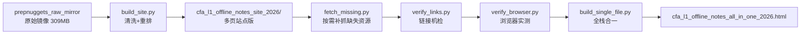
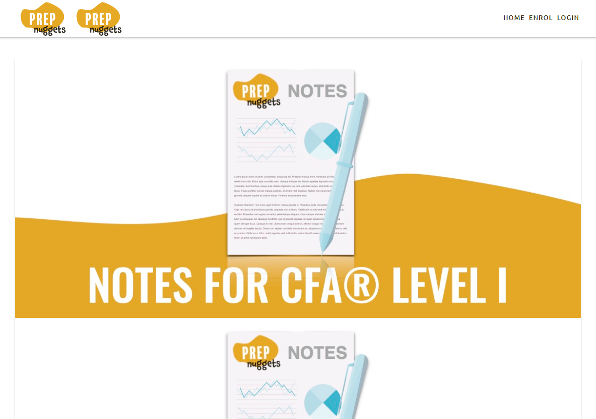
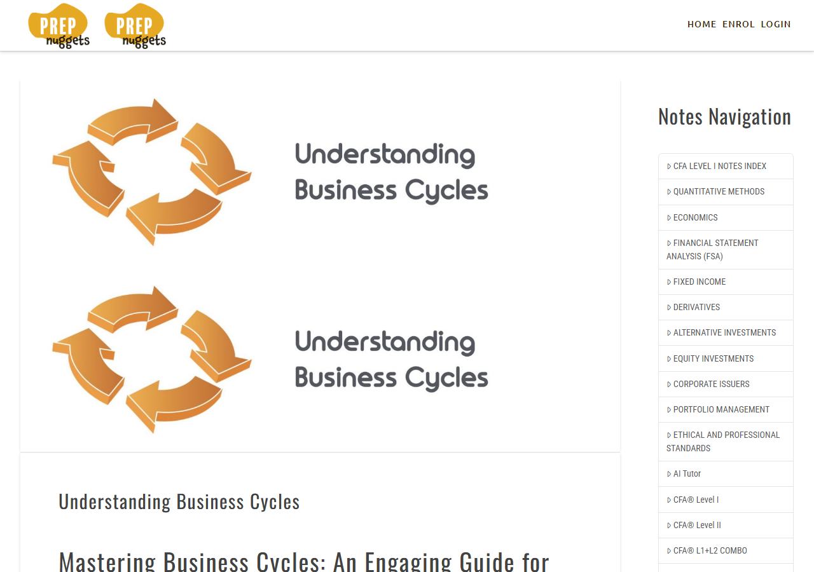
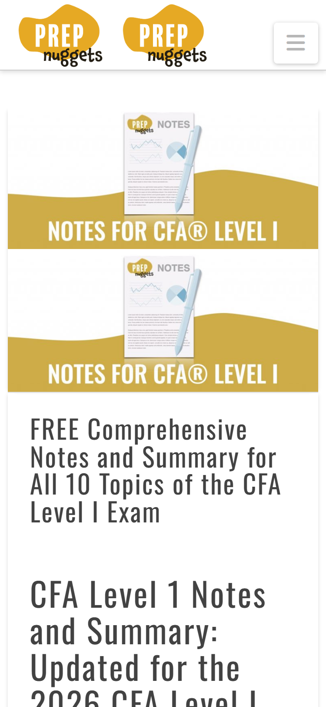

# CFA Level 1 Study Notes — PrepNuggets 离线站点（2026 版）

本项目把 **prepnuggets.com** 的 **CFA Level 1 学习笔记站**（`/cfa-level-1-study-notes/` 栏目，305 个页面、
3776 张图）完整克隆到本地，并加工成**可离线浏览的成品**：双击即用、零网络请求、跨设备可用。
2026 年年份标识：资料版本为 2026 考纲内容（原站当前版本）。

---

## 一、 秒上手（3 种用法）

| 场景 | 操作 |
|---|---|
| **电脑** | 双击 `cfa_l1_offline_notes_site_2026/index.html`（Chrome / Edge / Safari） |
| **安卓手机 / 平板** | 整个 `cfa_l1_offline_notes_site_2026/` 文件夹拷进设备 → 用 Chrome 打开其 `index.html` |
| **iPhone / iPad** | 拷进「文件」App → Safari 打开 `index.html`（可「分享 → 添加到主屏幕」全屏阅读） |
| **只想拷 1 个文件** | `cfa_l1_offline_notes_all_in_one_2026.html`（94.8 MB，全站合一，点击站内链接即切换页面） |

上手实测：桌面与手机视口首屏 **0.1–1.2 秒**，图片 100% 加载，0 控制台错误。

---

## 二、 内容

原站栏目（CFA 2026 Level 1，10 大主题 + 1 个附带栏目，目录名沿用原站路径，可对照原网址直接切换）：

| 本地目录 | 对应原站栏目 |
|---|---|
| `alternative-investments-study-notes/` | Alternative Investments |
| `corporate-issuers-study-notes/` | Corporate Issuers |
| `derivatives-study-notes/` | Derivatives |
| `economics-study-notes/` | Economics |
| `equity-investments-study-notes/` | Equity Investments |
| `ethics-study-notes/` | Ethics |
| `financial-statement-analysis-fsa-study-notes/` | Financial Statement Analysis（FSA） |
| `fixed-income-study-notes/` | Fixed Income |
| `portfolio-management-study-notes/` | Portfolio Management |
| `quantitative-methods-study-notes/` | Quantitative Methods |
| `quantitative-methods/` | 原站"量化方法"另一栏目页 |

每个栏目下按知识点分子目录（如 `economics-study-notes/understanding-business-cycles/`），层级与原站
`https://prepnuggets.com/cfa-level-1-study-notes/...` 完全一致。

**范围边界**：学习笔记正文/图表全部离线可用；公式（KaTeX）、图标字体（Font Awesome）、Google 字体均已本地化。
依赖原站服务器的功能（站内搜索、评论、会员登录、视频播放）离线不可用——视频嵌入处显示静态占位框
（导航图标与"Video (offline)"提示），与原站行为一致的风险点已在下方"八、常见问题"说明。

---

## 三、 两种成品对比

| | **多页站点版**（大文件夹） | **单文件版**（1 个 html） |
|---|---|---|
| 位置 | `cfa_l1_offline_notes_site_2026/` | `cfa_l1_offline_notes_all_in_one_2026.html` |
| 体积 | 309 MB | 94.8 MB |
| 翻页方式 | 真实多页面跳转（相对路径） | hash 路由（`#/economics-study-notes/` 等） |
| 首次加载 | ~0.1–1.0 s | ~1.2 s（一次性解析数据块） |
| 页面切换 | < 0.2 s | ~1–1.5 s |
| 图片 | 全分辨率多尺寸（srcset 响应式） | 原图字节无损内嵌（注册表去重，单尺寸取最大档） |
| 迁移性 | 拷整个文件夹（309 MB） | 拷 1 个文件（95 MB） |
| 适用 | 电脑/平板/手机常规使用，推荐 | 微信传一次就能全站带走、极小场合 |

两版渲染样式一致（自定义 CSS、图标字体、KaTeX 均验证一致：站点品牌 120px、导航大写等）。

---

## 四、 目录结构（2026-09 版命名）

```
cfa_l1_offline_notes/                        ← 项目根（本仓库）
├── README.md                                ← 本说明
├── docs/
│   ├── readme_images/                       ← 本 README 配图（验证时的真实截图）
│   └── superpowers/specs/                   ← 设计文档（历史）
├── prepnuggets_raw_mirror/                  ← 原始镜像（唯一源，构建输入，309 MB，不拷贝分发）
├── cfa_l1_offline_notes_site_2026/          ← 成品①：多页站点版（拷手机用这个）
│   ├── index.html                           ← 主页（最外层，双击即读）
│   ├── README.md                            ← 站点内使用说明（简短版）
│   └── <10 个栏目>/…                        ← 与原站同层级
├── cfa_l1_offline_notes_all_in_one_2026.html← 成品②：单文件版
└── tools/                                   ← 全部脚本（构建/补抓/校验），统一放这里
    ├── build_site.py                        ← 镜像 → 多页站点版（清洗+重排+缺图兜底）
    ├── fetch_missing.py                     ← 从原站补抓镜像缺失的少量资源（网络）
    ├── verify_links.py                      ← 链接机检：0 断链 / 0 远程引用 / 0 灰图占位
    ├── verify_browser.py                    ← Playwright 浏览器实测（截图/计时/错误审计）
    └── build_single_file.py                 ← 多页站点版 → 单文件版
```

**命名说明**（2026-09 应要求重命名，旧名 → 新名）：

| 旧名 | 新名 | 含义 |
|---|---|---|
| `CFA_Notes` | `cfa_l1_offline_notes` | CFA Level 1 离线笔记（项目根） |
| `offline_prepnuggets` | `prepnuggets_raw_mirror` | 原始镜像（raw mirror，构建输入） |
| `study_notes_site` | `cfa_l1_offline_notes_site_2026` | 成品①：多页离线站点，2026 版 |
| `full_site_single_file.html` | `cfa_l1_offline_notes_all_in_one_2026.html` | 成品②：全站合一单文件，2026 版 |

旧名对应的旧脚本（`fix_links.py`、`mirror_site.py`、`mirror_prepnuggets.py`）已被 `tools/` 新管线取代并删除
（git 历史中仍可查）。

---

## 五、 来源与克隆方法

产物全部来自 `prepnuggets_raw_mirror/` 这一份 **2019-2025 年间累积的站点快照**（原站点镜像工具
逐页抓取 `https://prepnuggets.com/cfa-level-1-study-notes/` 及所引用资源生成）。镜像本身保留了
WordPress 站点形态：`wp-content/`（主题/插件/上传图）、`wp-includes/`、`wp-json/`（REST API 快照）、
外加 `cdn.jsdelivr.net`（KaTeX）、`fonts.googleapis.com` / `fonts.gstatic.com`（Google 字体）三个跨域资源树。

本仓库不含镜像器本身（抓取已一次性完成）；默认无需重抓。仅当 `verify_links.py` 提示资源缺失时，
用 `fetch_missing.py` 按需从原站补抓（本工程实际补抓 6 个字体 + 8 处图片引用改写，未大量重爬）。



---

## 六、 重新构建（可选，按顺序执行）

```bash
cd cfa_l1_offline_notes
python tools/build_site.py          # 1) 镜像 → 多页站点版（清空重建）
python tools/fetch_missing.py       # 2) 有网络时补抓缺失字体（可选）
python tools/verify_links.py        # 3) 机检：必须输出 ALL CLEAN
python tools/verify_browser.py      # 4) Playwright 实测：0 错误 + 截图
python tools/build_single_file.py   # 5) 生成单文件版
```

---

## 七、 实测数据（2026-09-05，Playwright Chromium）

| 项目 | 多页站点版 | 单文件版 |
|---|---|---|
| 主机 | Windows 10，file:// 协议 | 同左 |
| 桌面 1280×900 首屏 | 浏览器加载 0.1–0.9 s（domContentLoaded 84–386 ms） | ~1.2 s |
| 手机 375×812 视口 | 同上（同套页面） | 26/26 图 |
| 图片加载 | 26/26（主页）/每页抽查全通过 | 26/26 + 随机 8 页路由 100% |
| 控制台错误 | 0 | 0 |
| 断链/远程引用/占位灰图 | 0 / 0 / 0（机检 306 页） | 0 |

截图（`docs/readme_images/`）：

| 主页（桌面） | 文章页 + 侧栏导航 | 手机视口 | 单文件版导航后 |
|---|---|---|---|
|  |  |  |  |

---

## 八、 常见问题

**Q1 为什么原来很卡/有灰图？**
原始镜像直接离线打开时残留大量远程引用（Google 统计、CleanTalk 反爬、ShareThis、gravatar 头像、
YouTube/Vimeo 嵌入、Google 字体），浏览器离线时逐项等网络超时（主页实测 22.8 秒）；图片为懒加载模式，
`src` 是灰色 SVG 占位、真实地址仍指向 `//prepnuggets.com`，离线拉取失败成灰块。`build_site.py` 已全部
清理：删除远程引用、懒加载展开为本地真实路径、字体/资源本地化、`%` 转义文件名迁移（file:// 下不可达）。

**Q2 视频为什么是灰色占位框？**
原站视频来自 YouTube/Vimeo 流媒体，无法离线化。按需求保留为静态占位（标题 + "Video (offline)"），
避免离线时网络挂起拖慢页面（这本身也是卡顿修复的一部分）。

**Q3 单文件版为什么 95 MB？**
原图无损内嵌（用户选定方案）：3776 张图共约 74 MB 的 base64 去重注册表 + 305 页正文 + 字体/CSS。
若希望更小，可对图片重压缩增量替换（需在 `build_single_file.py` 增改图片处理策略）。

**Q4 下载失败/图片缺失？**
镜像已覆盖 99%+ 资源；缺失项经 `fetch_missing.py` 补抓或改写为同图变体（原站已删除的 2 张图）。
若 `verify_links.py` 再报 broken ref，按第六节命令重跑即可定位。

---

*维护：2026-09-05 全量整理，git 5 次提交（基线 → 设计 → 文件夹版 → 单文件版 → 重命名清理）。*
